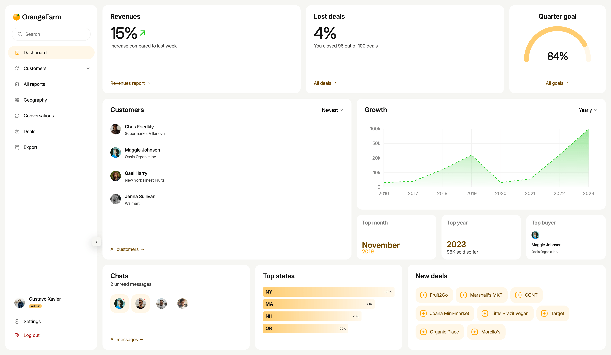

# Dashboard for OrangeFarm

### [Demo link](https://junfrenkixp.github.io/dashboard-orange-farm/)

### [Link to the layout in Figma](https://www.figma.com/design/sg9RjXAiubQTnZ5L4kifYV/OrangeFarm?node-id=0-1&p=f&t=ojZYAV0hUIjd3VZS-0)

## About the Project

A single-page, responsive dashboard built with Flexbox and Grid Layout.

The project is built as a set of reusable Twig macros (a mini design system), so UI elements are consistent and easy to extend. All interactive behaviour is written in vanilla JavaScript — without any third-party UI libraries.

### Key features

- **Interactive sidebar** — collapsible with smooth animation, links keep their state, and inner lists (submenus) work independently of each other.
- **Custom dropdowns** — used for sorting and for switching the chart period. Each dropdown is self-contained and does not interfere with other dropdowns on the page.
- **Chart with period switcher** — an area chart with gradient fill, dashed line, custom Y-axis steps (`0, 10k, 20k, 50k, 100k`) and a hover tooltip.
- **Custom sorting** — customers list can be re-ordered on the fly from the dropdown.
- **Icon system** — single SVG sprite, all icons rendered via `<use>`, decorative icons marked with `aria-hidden="true"`.
- **Responsive overflow handling** — sidebar, dropdown menus and lists are built to degrade gracefully when content overflows: no clipped items, no broken layout on smaller screens.
- **Accessibility-aware markup** — `aria-*` attributes on toggles, decorative SVG hidden from screen readers, `<button type="button">` everywhere to avoid accidental form submissions.

## Technologies Used

- HTML5 (Twig templates + reusable macros)
- CSS3 (Flexbox, Grid)
- JavaScript (Vanilla JS, event delegation)

## Credits

- Design: [OrangeFarm on Figma](https://www.figma.com/design/sg9RjXAiubQTnZ5L4kifYV/OrangeFarm?node-id=0-1&p=f&t=ojZYAV0hUIjd3VZS-0)
- Chart library: [ApexCharts](https://apexcharts.com/)
- Icons: [Tabler icons](https://tabler.io/icons)
